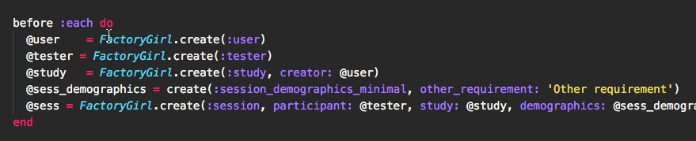

# letize package

- Has [betterspecs](http://betterspecs.org/#let) convinced you that `let` is the way to go?
- Are you spending all day `let`izing legecy specs?
- This package to the rescue!



## Example

```ruby
# Turns this:
blah = create(:lasdflkaj)
@foo    = FactoryGirl.create(Blah)

# Into this:
let(:blah) { create(:lasdflkaj) }
let(:foo) { create(Blah) }
```
